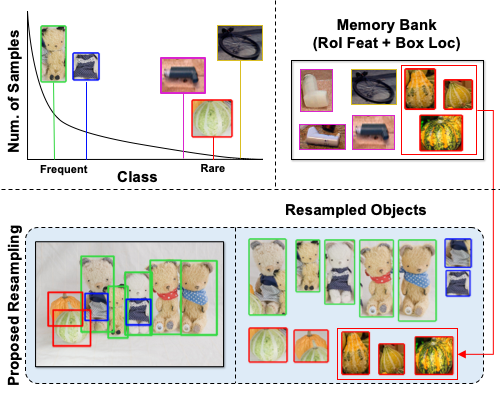

[](https://github.com/NVlabs/RIO/blob/master/LICENSE)


# Image-Level or Object-Level? A Tale of Two Resampling Strategies for Long-Tailed Detection

<!--  -->
<div align="center">
  
</div>
<p align="center">
  Figure 1: Our proposed Resampling at image-level and obect-level (RIO).
</p>

### [Project page](https://github.com/NVlabs/RIO) | [Paper](https://arxiv.org/abs/2104.05702) 

Image-Level or Object-Level? A Tale of Two Resampling Strategies for Long-Tailed Detection. <br>
[Nadine Chang](nadinechang.com), [Zhiding Yu](https://chrisding.github.io), [Yu-Xiong Wang](https://yxw.web.illinois.edu), [Anima Anandkumar](http://tensorlab.cms.caltech.edu/users/anima/), [Sanja Fidler](https://www.cs.utoronto.ca/~fidler/), [Jose M. Alvarez](https://rsu.data61.csiro.au/people/jalvarez/).<br>
ICML 2021.

This repository contains the official Pytorch implementation of training & evaluation code and the pretrained models for [RIO](https://arxiv.org/abs/2104.05702).<br>

## Abstract
Training on datasets with long-tailed distributions has been challenging for major recognition tasks such as classification and detection. To deal with this challenge, image resampling is typically introduced as a simple but effective approach. However, we observe that long-tailed detection differs from classification since multiple classes may be present in one image. As a result, image resampling alone is not enough to yield a sufficiently balanced distribution at the object level. We address object-level resampling by introducing an object-centric memory replay strategy based on dynamic, episodic memory banks. Our proposed strategy has two benefits: 1) convenient object-level resampling without significant extra computation, and 2) implicit feature-level augmentation from model updates. We show that image-level and object-level resamplings are both important, and thus unify them with a joint resampling strategy (RIO). Our method outperforms state-of-the-art long-tailed detection and segmentation methods on LVIS v0.5 across various backbones. <br>


## Requirements
- Linux or maxOS with Python >= 3.6
- PyTorch >= 1.5 and torchvision corresponding to PyTorch installation. Please refer to download guildlines at the [PyTorch website](pytorch.org)
- Detectron2 
- OpenCV is optional but required for visualizations

## Installation

#### Detectron2 
Please refer to the installation instructions in [Detectron2](https://github.com/facebookresearch/detectron2/blob/master/INSTALL.md).<br>

We use [Detectron2 v0.3](https://github.com/facebookresearch/detectron2/tree/d54c674d46c88f60a0d1215f80b4f353bfba76db) as the codebase. Thus, we advise installing Detectron2 from a clone of this repository.

#### LVIS Dataset 
Dataset download is available at the official [LVIS website](https://www.lvisdataset.org/dataset). Please follow [Detectron's guildlines](https://github.com/facebookresearch/detectron2/tree/master/datasets) on expected LVIS dataset structure.

#### Our Setup
- Python 3.6.9
- PyTorch 1.5.0 with CUDA 10.2
- Detectron2 built from this repository.

## Pretrained Models

Detection and Instance Segmentation on LVIS v0.5
<table><tbody>
<!-- START TABLE -->
<!-- TABLE HEADER -->
<th valign="bottom", align="left">Backbone</th>
<th valign="bottom", align="left">Method</th>
<th valign="bottom">AP.b</th>
<th valign="bottom">AP.b.r</th>
<th valign="bottom">AP.b.c</th>
<th valign="bottom">AP.b.f</th>
<th valign="bottom">AP.m</th>
<th valign="bottom">AP.m.r</th>
<th valign="bottom">AP.m.c</th>
<th valign="bottom">AP.m.f</th>
<th valign="bottom">download</th>
<tr>
<td align="left">R50-FPN</td>
<td align="left">MaskRCNN-RIO</td>
<td align="center">25.7</td>
<td align="center">17.2</td>
<td align="center">25.1</td>
<td align="center">29.8</td>
<td align="center">26.0</td>
<td align="center">18.9</td>
<td align="center">26.2</td>
<td align="center">28.5</td>
<td align="center"><a href="https://drive.google.com/file/d/1hvd8tHkhGBnK07OIv2Wa0328uCJSKl-4/view?usp=sharing">model</a></td>
</tr>
  
<tr>
<td align="left">R101-FPN</td>
<td align="left">MaskRCNN-RIO</td>
<td align="center">27.3</td>
<td align="center">19.1</td>
<td align="center">26.8</td>
<td align="center">31.2</td>
<td align="center">27.7</td>
<td align="center">20.1</td>
<td align="center">28.3</td>
<td align="center">30.0</td>
<td align="center"><a href="https://drive.google.com/file/d/161hJdbhtZuWAU-WP7DOca74mKAE3pc8G/view?usp=sharing">model</a></td>
</tr>
  
<tr>
<td align="left">X101-FPN</td>
<td align="left">MaskRCNN-RIO</td>
<td align="center">28.6</td>
<td align="center">19.0</td>
<td align="center">28.0</td>
<td align="center">33.0</td>
<td align="center">28.9</td>
<td align="center">19.5</td>
<td align="center">29.7</td>
<td align="center">31.6</td>
<td align="center"><a href="https://drive.google.com/file/d/1MdFhBF_Up842GYJ3929Up1eOXDk2Y-HF/view?usp=sharing">model</a></td>
</tr>
</tbody></table>

## Training & Evaluation

Our code is located under [projects/RIO](https://github.com/NVlabs/RIO/tree/master/projects/RIO). <br>

Our training and evaluation follows those of Detectron2's. We've provided config files for both LVISv0.5 and LVISv1.0.

Example: Training LVISv0.5 on Mask-RCNN ResNet-50

```
# We advise multi-gpu training
cd projects/RIO
python memory_train_net.py \
--num-gpus 4 \
--config-file=configs/LVISv0.5-InstanceSegmentation/memory_mask_rcnn_R_50_FPN_1x.yaml 
```

Example: Evaluating LVISv0.5 on Mask-RCNN ResNet-50
```
cd projects/RIO
python memory_train_net.py \
--eval-only MODEL.WEIGHTS /path/to/model_checkpoint \
--config-file configs/LVISv0.5-InstanceSegmentation/memory_mask_rcnn_R_50_FPN_1x.yaml  
```

By default, LVIS evaluation follows immediately after training. 

## Visualization
Detectron2 has built-in visualization tools. Under tools folder, visualize_json_results.py can be used to visualize the json instance detection/segmentation results given by LVISEvaluator. 

```
python visualize_json_results.py --input x.json --output dir/ --dataset lvis
```

Further information can be found on [Detectron2 tools' README](https://github.com/facebookresearch/detectron2/tree/master/tools).


## License
Please check the LICENSE file. RIO may be used non-commercially, meaning for research or 
evaluation purposes only. For business inquiries, please contact 
[researchinquiries@nvidia.com](mailto:researchinquiries@nvidia.com).


## Citation


```BibTeX
@article{chang2021image,
  title={Image-Level or Object-Level? A Tale of Two Resampling Strategies for Long-Tailed Detection},
  author={Chang, Nadine and Yu, Zhiding and Wang, Yu-Xiong and Anandkumar, Anima and Fidler, Sanja and Alvarez, Jose M},
  journal={arXiv preprint arXiv:2104.05702},
  year={2021}
}
```
